## Smuggling HTTP requests over fake WebSocket connection

### 0. WebSocket protocol

WebSocket communication consists of two parts: handshake and data transfer. Firstly TCP or TLS connection is established with the backend, next handshake part takes place over established connection. And finally WebSocket frames are transfered through **the same TCP or TLS connection**.

WebSocket protocol is described in [RFC 6455](https://tools.ietf.org/html/rfc6455).

Let's observe handshake part that's done over HTTP protocol of version 1.1 (as described in RFC 6455). Client sends GET request (aka **Upgrade request**) to the backend with the set of special HTTP headers: `Upgrade`, `Sec-WebSocket-Version`, `Sec-WebSocket-Key`.

```
GET /socket.io/?EIO=3&transport=websocket HTTP/1.1
Host: websocket.example.com
Sec-WebSocket-Version: 13
Origin: http://websocket.example.com
Sec-WebSocket-Key: nf6dB8Pb/BLinZ7UexUXHg==
Connection: keep-alive, Upgrade
Pragma: no-cache
Cache-Control: no-cache
Upgrade: websocket

```

Where `Sec-WebSocket-Version` contains WebSocket protocol version (most of the times only version `13` is supported). Header `Sec-WebSocket-Key` contains random nonce encoded as base64. And `Upgrade` header contain value `websocket`.

Backend should responds with status code `101` and acknowledge nonce sent by client. Backend should compute confirmation value using nonce from client and send it inside `Sec-WebSocket-Accept` HTTP Header.

```
HTTP/1.1 101 Switching Protocols
Upgrade: websocket
Connection: Upgrade
Sec-WebSocket-Accept: xUFfT1/AIvZnGdK/XSbIr7zQO10=

```

After successfull handshake client or backend can transfer data using WebSocket frames. There are different types of frames. Each frame has field `opcode` to indicate its type.

**What's important that client must do so-called client-to-server masking!** Masking is done to mitigate potential attacks on infrastructure that proxies WebSocket connections between client and backend. As pointed in RFC 6455, there was a [research](http://www.adambarth.com/papers/2011/huang-chen-barth-rescorla-jackson.pdf) showing cache poisoning attacks against proxies in case client doesn't perform client-to-server masking. We will see shortly that it also leads to smuggling attacks.

### 1. WebSocket connection reverse proxying

In real web applications client and backend communicate through some reverse proxy. Currently most of web servers, load balancer, http proxies allow to proxy WebSocket traffic.

Let's observe how WebSocket communication should be done in case reverse proxy is envolved. Below an ideal picture is described.

On the first step client sends Upgrade request to the reverse proxy. Proxy checks that incoming request is indeed Upgrade request by checking HTTP method, `Upgrade` header, version from `Sec-WebSocket-Version` header, presence of `Sec-WebSocket-Key` header, etc. If request is a correct Upgrade request proxy translates it to the backend.

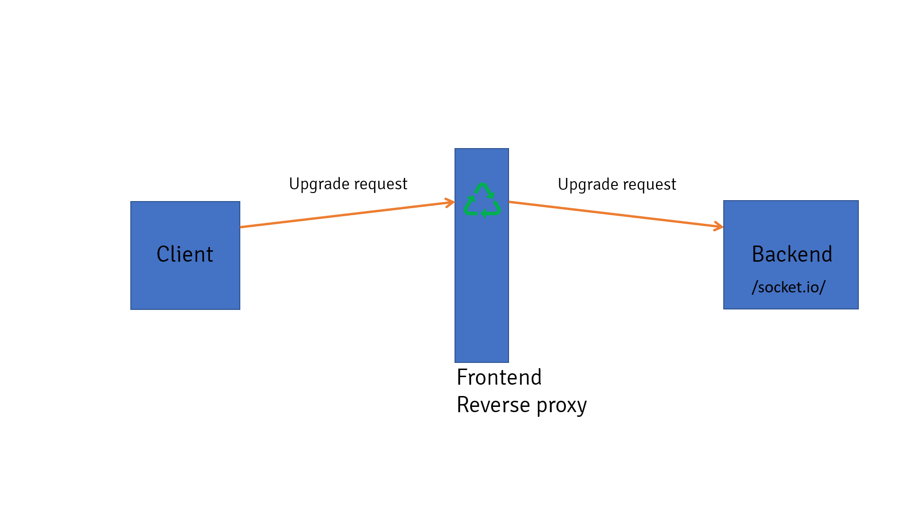

On the second step backend answers reverse proxy with HTTP response that has status code `101`. Response also has `Upgrade` and `Sec-WebSocket-Accept` headers. Reverse proxy should check that backend indeed is ready to establish WebSocket connection by checking status code and other headers. If everyhing is correct reverse proxy translates response from backend to the client.

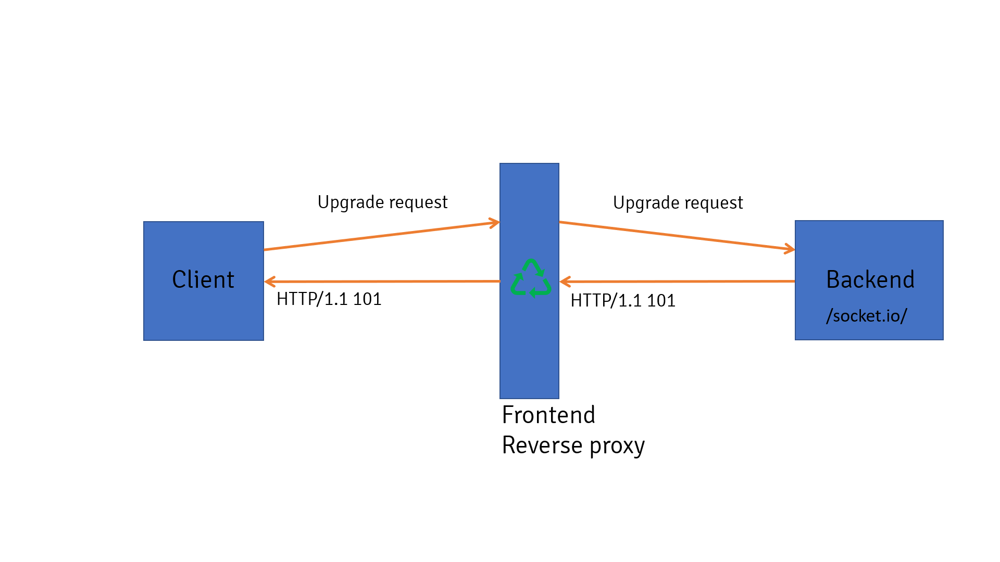

On the third step proxy doesn't close TCP or TLS connection between client and backend and they both agreed to use this connection for WebSocket communication. Since than client and backend can send WebSocket frames back and forth. Proxy should check that client sends masked WebSocket frames.

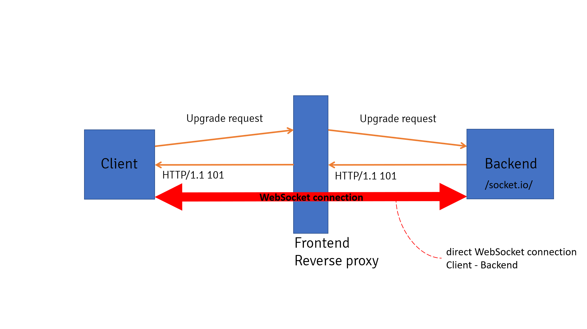

### 2. Smuggling techniques

In reality, however, reverse proxies can behave differently and do not adhere fully to RFC 6445. This leads to smuggling attacks.

### 2.1 Scenario 1

Let's observe first scenario. We have backend that exposes public WebSocket API and also has internal REST API not available from outside. Malicious client wants to access internal REST API.

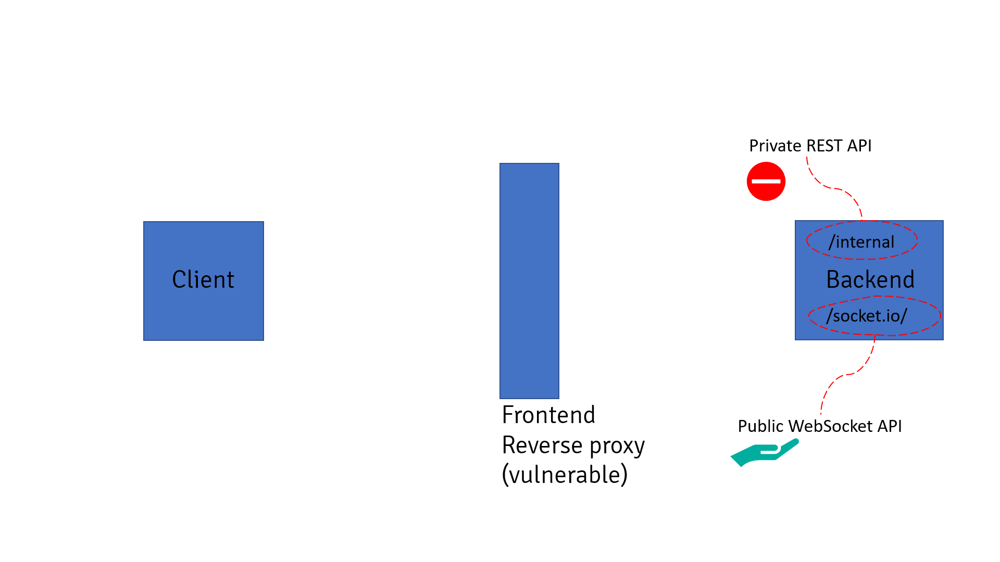

On the first step client sends Upgrade request to reverse proxy but with wrong protocol version inside header `Sec-WebSocket-Version`. Proxy doesn't validate `Sec-WebSocket-Version` header and thinks that Upgrade request is correct. Further it translates request to the backend.

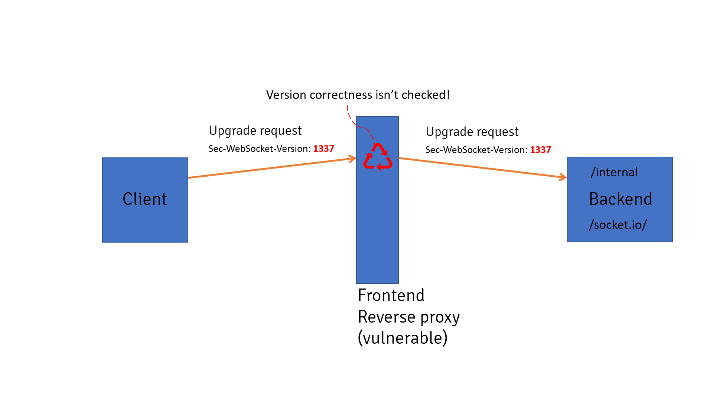

On the second step backend sends response with status code `426` because protocol version is incorrect inside header `Sec-WebSocket-Version`. However, reverse proxy doesn't check enough response from backend (including status code) and thinks that backend is ready for WebSocket communication. Further it translates request to the client.

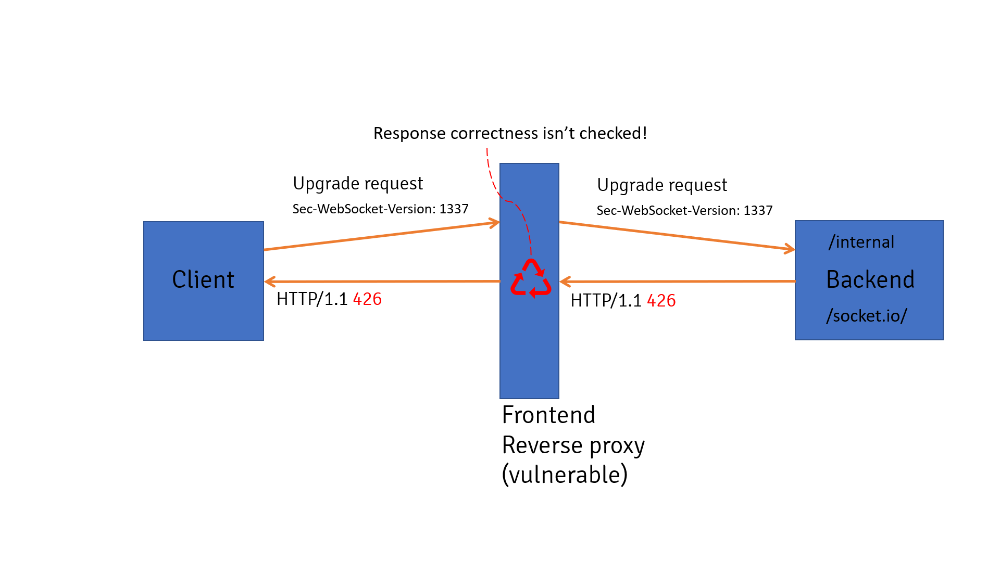

Finally, reverse proxy thinks that WebSocket connection is established between client and backend. In reality there is no WebSocket connection - backend refused Upgrade request. At the same time, proxy keeps TCP or TLS connection between client and backend in open state. **Client can easily access private REST API by sending HTTP request over the connection.**

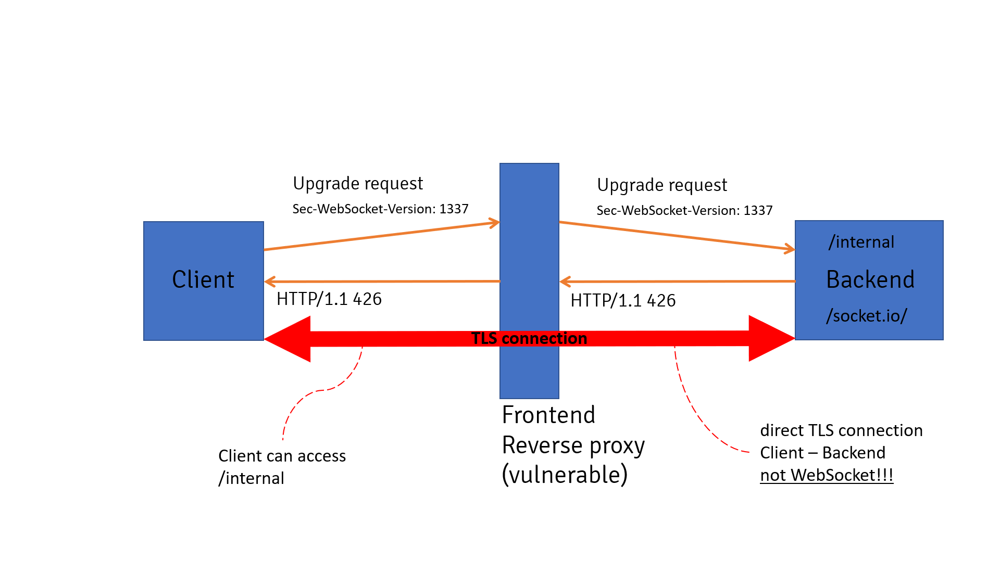

It was found that following reverse proxies are affected:
* Varnish - team refused to fix described issue.
* Envoy proxy 1.8.0 (or older) - in newer versions upgrade mechanism has been changed.
* Others - TBA.

First challenge utilized described scenario. To solve it you should access flag from localhost and port 5000. Backend is based on `Flask` with `eventlen` module as web server. Module `Flask-SocketIO` is used for WebSocket support. Module `Flask-Restful` is used for building REST API.

### 2.2 Scenario 2

The majority of reverse proxies (e.g. NGINX) check status code from backend during handshake part. This makes attack harder but not impossible.

Let's observe second scenario. We have backend that exposes public WebSocket API and public REST API for health checking and also has internal REST API not available from outside. Malicious client wants to access internal REST API. NGINX is used as reverse proxy. WebSocket API is available on path `/api/socket.io/` and healthcheck API on path `/api/health`.

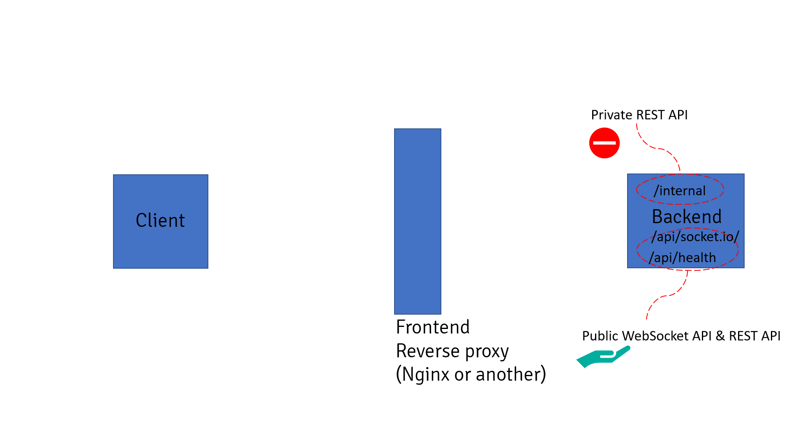

Healthcheck API is invoked by sending POST request, parameter with name `u` controls URL. Backend reaches external resource and returns status code back to the client.

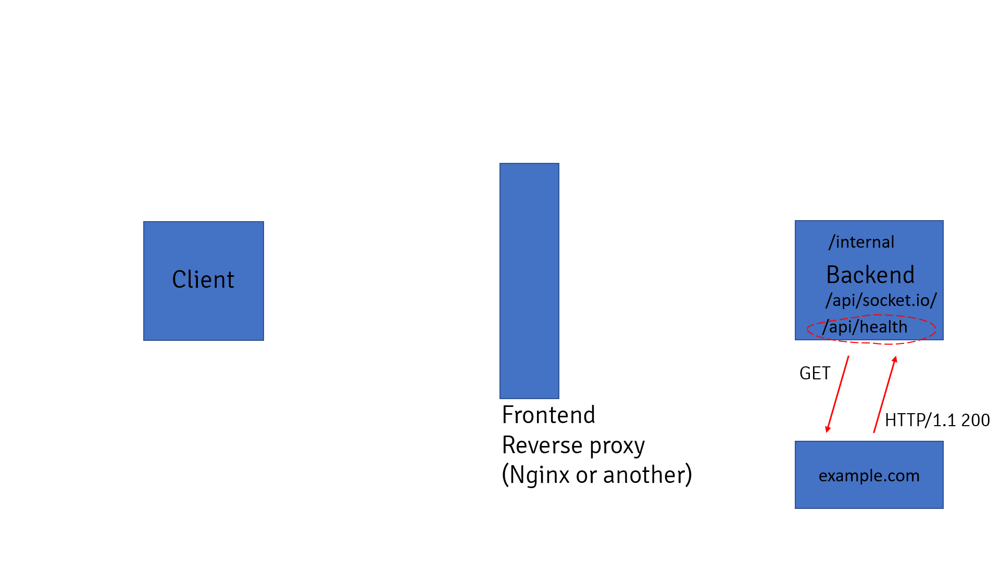

On the first step client sends POST request to invoke healthcheck API but with additional HTTP header `Upgrade: websocket`. NGINX thinks that it's a normal Upgrade request, it looks only for `Upgrade` header skipping other parts of the request. Further proxy translates request to the backend.

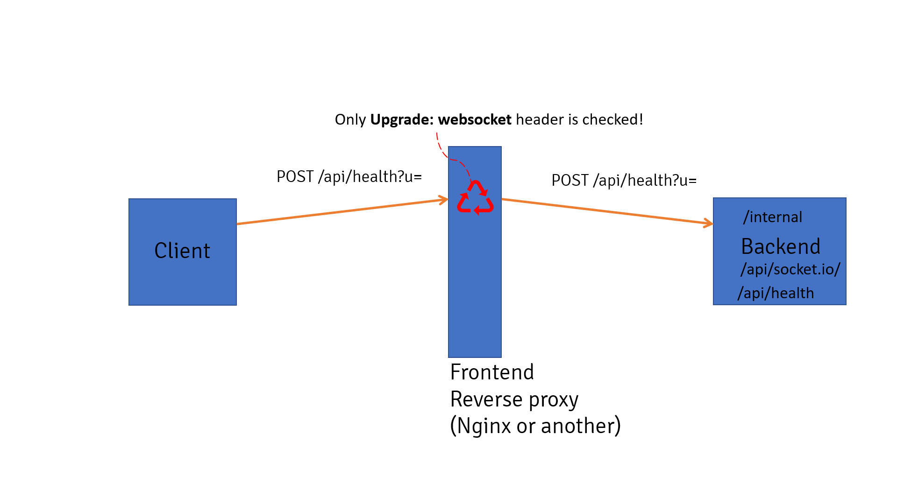

On the second step backend invokes healtcheck API. It reaches external resource controlled by malicious users that returns HTTP response with status code `101`. Backend translates that response to the reverse proxy. Since NGINX validates only status code it will think that backend is ready for WebSocket communication. Further it translates request to the client.

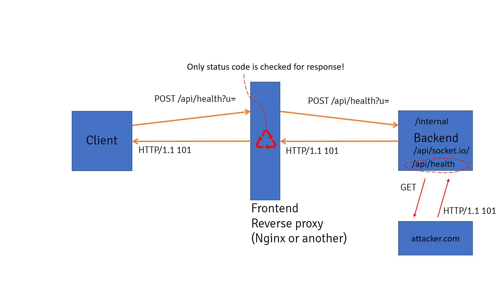

Finally, NGINX thinks that WebSocket connection is established between client and backend. In reality there is no WebSocket connection - healthcheck REST API was invoked on backend. At the same time, reverse proxy keeps TCP or TLS connection between client and backend in open state. **Client can easily access private REST API by sending HTTP request over the connection.**

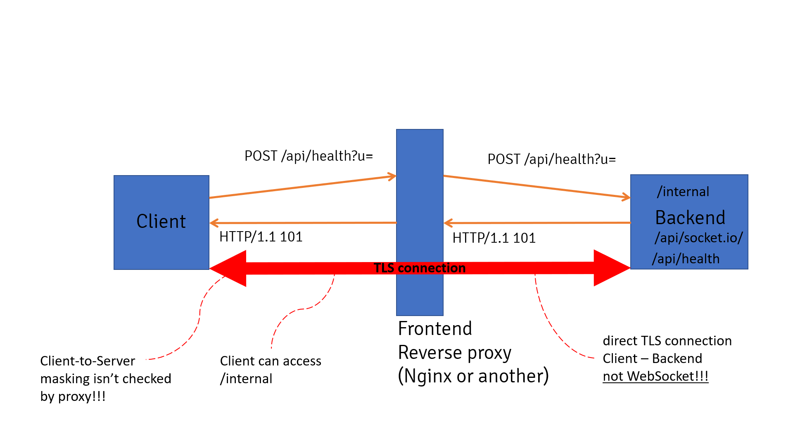

The majority of reverse proxies should be affected by that scenario. However, exploitation requires existence of external SSRF vulnerability (usually considered low-severity issue).

Second challenge utilized described scenario. To solve it you should access flag from localhost and port 5000. Backend is based on `Flask` with `eventlen` module as web server. Module `Flask-SocketIO` is used for WebSocket support. Module `Flask-Restful` is used for building REST API.

NGINX is used as a reverse proxy with the following configuration allowing WebSocket communication for path `/api/public`.

```
location ~ ^/api/public {
    proxy_pass http://127.0.0.1:5000;
    proxy_http_version 1.1;
    proxy_set_header Upgrade $http_upgrade;
    proxy_set_header Connection "upgrade";
}
```
